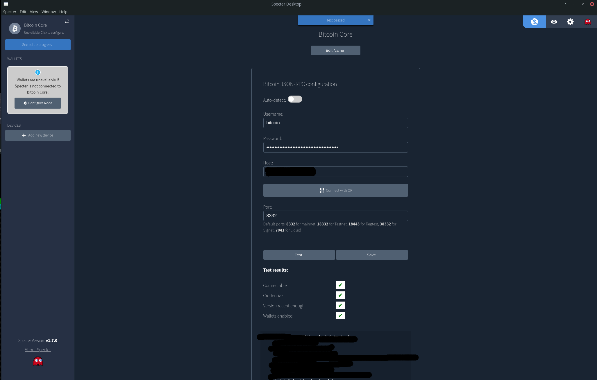
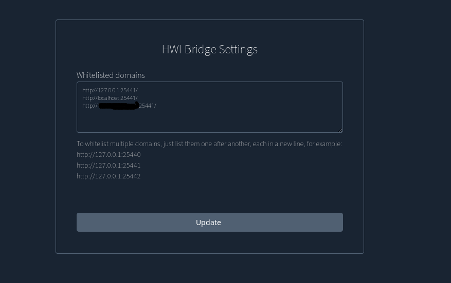
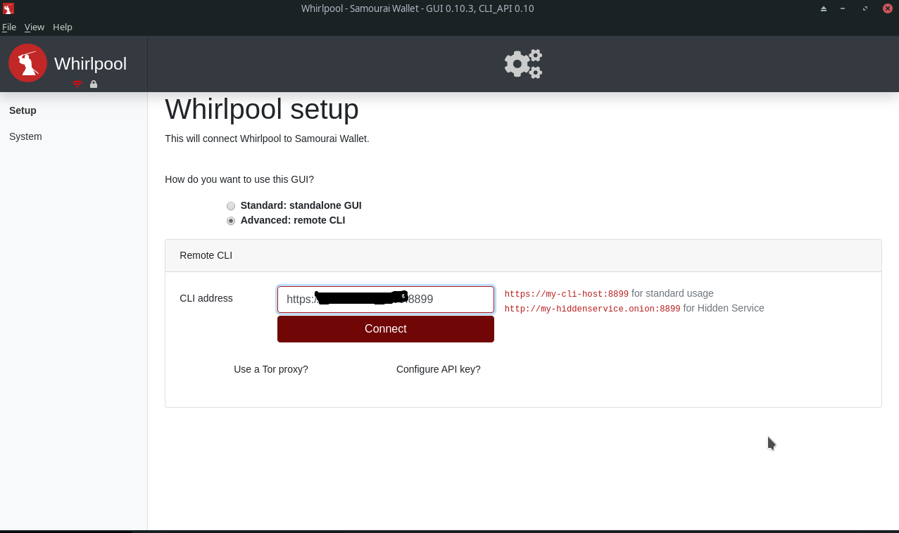
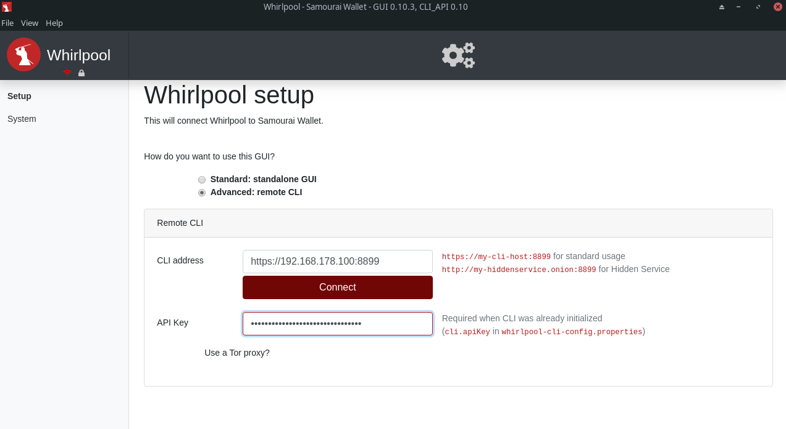
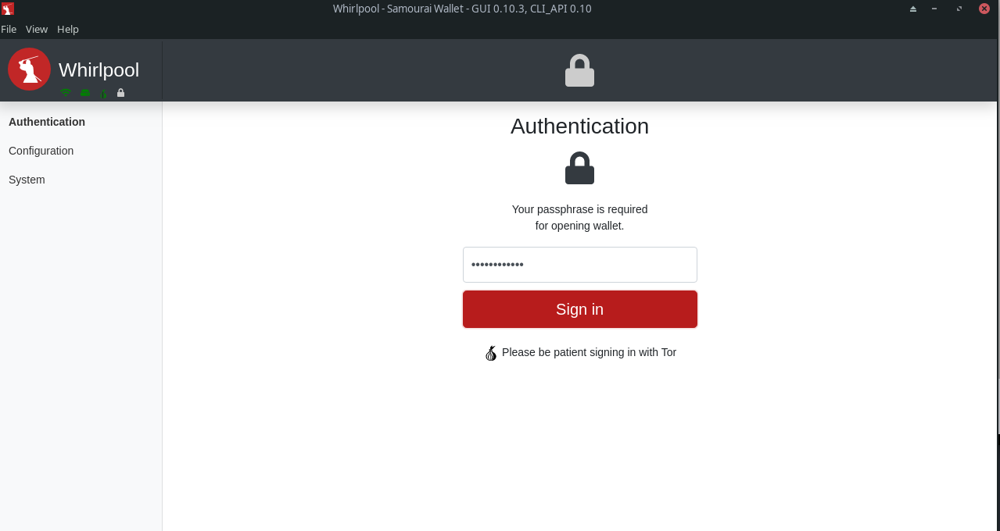

# Bitcoin-FullNode
Run a BTC full node for fun


A Huge thanks to Ministry of Nodes and his precious video tutorial. What you will find here is nothing but an updated 
step by step guide to that video tutorial. I strongly reccomend you to visit the channel and watch his content.

[Ministry of Nodes](https://www.youtube.com/c/MinistryofNodes)


# Dedicated HDD preparation and migration of /home

```
$ fdisk /dev/sdb
```

- n
- p
- enter
- enter
- t
- 31
- w

> We are going to use the entire disk, so nothing fancy.

```bash
$ pvcreate /dev/sdb1
$ pvs
$ vgcreate vg_home /dev/sdb1
$ lvcreate -l 100%FREE -n lv_home vg_home
$ mkfs.xfs /dev/vg_home/lv_home
$ mount /dev/vg_home/lv_home /mnt
$ cp -pr /home/* /mnt
$ mv /home /home.orig
$ mkdir /home
$ chmod 1777 /home
$ chwon root:root /home
$ nano /etc/fstab (append to the file)
```

```
/dev/vg_home/lv_home /home                xfs     defaults,noatime 1 2
```

```
sudo reboot
```

# Install TOR if you did not

```
$ sudo apt install tor 
```


# Download Files


[BitcoinCore](https://bitcoincore.org/en/download/)

```
$ wget https://bitcoincore.org/bin/bitcoin-core-22.0/SHA256SUMS
$ wget https://bitcoincore.org/bin/bitcoin-core-22.0/SHA256SUMS.asc
$ wget https://bitcoincore.org/bin/bitcoin-core-22.0/bitcoin-22.0-x86_64-linux-gnu.tar.gz
```

>if you are upgrading the version and want to verify the new packege, consider to run gpg --keyserver hkp://keyserver.ubuntu.com --refresh-keys


# Verify the Package

```
$ cd Downloads/
$ sha256sum --ignore-missing --check SHA256SUMS
```

_In the output produced by the above command, you can safely ignore any warnings and failures, but you must ensure the output lists "OK" after the name of the release file you downloaded_

```
$ gpg --keyserver hkp://keyserver.ubuntu.com --recv-keys E777299FC265DD04793070EB944D35F9AC3DB76A
```

_The output of the command above should say that one key was imported, updated, has new signatures, or remained unchanged._

```
$ gpg --verify SHA256SUMS.asc
```

_Search for a line with "gpg: Good signature"_


# Install Bitcoind

```
$ sudo install -m 0755 -o root -g root -t /usr/local/bin bitcoin-22.0/bin/*
```

_let it run (not needed) until you will see "2021-10-30T14:07:08Z Synchronizing blockheaders, height: 707434 (~100.00%)" and than interrupt it (CTRL-C)_


# Confiure Bitcoind 

```bitcoin.conf

server=1
blockfilterindex=1
txindex=1
rpcport=8332
rpcbind=0.0.0.0
rpcallowip=127.0.0.1
rpcallowip=10.0.0.0/8
rpcallowip=172.0.0.0/8
rpcallowip=192.0.0.0/8
zmqpubrawblock=tcp://0.0.0.0:28332
zmqpubrawtx=tcp://0.0.0.0:28333
zmqpubhashblock=tcp://0.0.0.0:28334
rpcuser=YOUR_USER
rpcpassword=YOUR_PASSWD
```


# Configure the service

```
$ cd /etc/systemd/system/
$ sudo nano bitcoind.service
```

> Note: replace "***" with yours

```bitcoind.service

# It is not recommended to modify this file in-place, because it will
# be overwritten during package upgrades. If you want to add further
# options or overwrite existing ones then use
# $ systemctl edit bitcoind.service
# See "man systemd.service" for details.

# Note that almost all daemon options could be specified in
# /etc/bitcoin/bitcoin.conf, but keep in mind those explicitly
# specified as arguments in ExecStart= will override those in the
# config file.

[Unit]
Description=Bitcoin daemon
Documentation=https://github.com/bitcoin/bitcoin/blob/master/doc/init.md

# https://www.freedesktop.org/wiki/Software/systemd/NetworkTarget/
After=network-online.target
Wants=network-online.target

[Service]
ExecStart=/usr/local/bin/bitcoind -daemonwait \
                            -pid=/run/bitcoind/bitcoind.pid \
                            -conf=/home/***/.bitcoin/bitcoin.conf \
                            -datadir=/home/***/.bitcoin

# Make sure the config directory is readable by the service user
#PermissionsStartOnly=true
#ExecStartPre=/bin/chgrp bitcoin /etc/bitcoin

# Process management
####################

Type=forking
PIDFile=/run/bitcoind/bitcoind.pid
Restart=on-failure
TimeoutStartSec=infinity
TimeoutStopSec=600

# Directory creation and permissions
####################################

# Run as bitcoin:bitcoin
User=***
Group=***

# /run/bitcoind
RuntimeDirectory=bitcoind
RuntimeDirectoryMode=0710

# /etc/bitcoin
ConfigurationDirectory=bitcoin
ConfigurationDirectoryMode=0710

# /var/lib/bitcoind
StateDirectory=bitcoind
StateDirectoryMode=0710

# Hardening measures
####################

# Provide a private /tmp and /var/tmp.
PrivateTmp=true

# Mount /usr, /boot/ and /etc read-only for the process.
#ProtectSystem=full

# Deny access to /home, /root and /run/user
#ProtectHome=true

# Disallow the process and all of its children to gain
# new privileges through execve().
NoNewPrivileges=true

# Use a new /dev namespace only populated with API pseudo devices
# such as /dev/null, /dev/zero and /dev/random.
PrivateDevices=true

# Deny the creation of writable and executable memory mappings.
MemoryDenyWriteExecute=true

[Install]
WantedBy=multi-user.target
```

```
$ sudo systemctl enable bitcoind.service
$ sudo systemctl start bitcoind
$ tail -f /home/satoshi/.bitcoin/debug.log
```

_If you did not made mistakes, everything should be allright._


# Bitcoin Sync

_Now that you set up everything what we needed, we have to wait the end of block sync process, it will takes a while, depending from bandwith, PC hardware limitation, TOT blocks numbers_

_you can monitor the status and healty of the process with_

```
$ bitcoin-cli getblockchaininfo
$ bitcoin-cli getconnectioncount
```

Ex JSON Resp of getblockchaininfo:

```json
"chain": "main", 
"blocks": 503527, 
"headers": 707440,
```

> Note: When Blocks and Headers will match in number, you will be done.


> Double check you are effectivelly connected through Tor (search in log for)

```
2021-11-01T16:15:30Z tor: Got service ID 4hxxlpcqzvsdd23xcgdwgvatrbzcwifvp36kvbsynkyb2mee3r5cpyad, advertising service 4hxxlpcqzvsdd23xcgdwgvatrbzcwifvp36kvbsynkyb2mee3r5cpyad.onion:8333
```

_Some useful Cmd:_

```
$ bitcoin-cli getnetworkinfo
$ bitcoin-cli getconnectioncount
$ bitcoin-cli getpeerinfo
```


# Shape your bitcoin.conf file 

For a fully walk through in parameters and command used to generate the needed values, please refer to:


[Tor Guide](https://blog.lopp.net/tor-only-bitcoin-lightning-guide/)
[Tor Hidden Service](https://en.bitcoin.it/wiki/Setting_up_a_Tor_hidden_service)


```bitcoin.conf

server=1
blockfilterindex=1
rpcport=8332
rpcbind=0.0.0.0
rpcallowip=127.0.0.1
rpcallowip=127.0.0.0/8
rpcallowip=172.0.0.0/8
rpcallowip=192.0.0.0/8
rpcuser=YOUR_USER_HERE
rpcpassword=YOUR_PASSWD_HERE


# [core]
# Maintain a full transaction index (improves lnd performance)
txindex=1
daemon=1
disablewallet=0
maxuploadtarget=1000


# [rpc]
# Accept command line and JSON-RPC commands.
server=1
rpcauth="YOUR_USER_HERE":"STRING_GENERATED_VIA_rpcauth.py"


# [zeromq]
# Enable publishing of transactions to [address]
zmqpubrawtx=tcp://127.0.0.1:28333
# Enable publishing of raw block hex to [address].
zmqpubrawblock=tcp://127.0.0.1:28332
# Not Clear
zmqpubhashblock=tcp://0.0.0.0:28334

# Privacy
proxy=127.0.0.1:9050
#bind=127.0.0.1
bind=127.0.0.1:8333
# Allow DNS lookups for -addnode, -seednode and -connect values.
dns=0
# Query for peer addresses via DNS lookup, if low on addresses.
dnsseed=0
# Specify your own public IP address.
externalip="STRING_GENERATED_VIA_getnetworkinfo".onion
# Use separate SOCKS5 proxy to reach peers via Tor
onion=127.0.0.1:9050
proxy=127.0.0.1:9050
proxyrandomize=1
# Only connect to peers via Tor.
onlynet=onion
listenonion=1
listen=1
# helps bootstrap peers for initial sync
addnode=gyn2vguc35viks2b.onion
addnode=kvd44sw7skb5folw.onion
addnode=nkf5e6b7pl4jfd4a.onion
addnode=yu7sezmixhmyljn4.onion
addnode=3ffk7iumtx3cegbi.onion
addnode=3nmbbakinewlgdln.onion
addnode=4j77gihpokxu2kj4.onion
addnode=546esc6botbjfbxb.onion
addnode=5at7sq5nm76xijkd.onion
addnode=77mx2jsxaoyesz2p.onion
addnode=7g7j54btiaxhtsiy.onion
addnode=a6obdgzn67l7exu3.onion
addnode=ab64h7olpl7qpxci.onion
addnode=am2a4rahltfuxz6l.onion
addnode=azuxls4ihrr2mep7.onion
addnode=bitcoin7bi4op7wb.onion
addnode=bitcoinostk4e4re.onion
addnode=bk7yp6epnmcllq72.onion
addnode=bmutjfrj5btseddb.onion
addnode=ceeji4qpfs3ms3zc.onion
addnode=clexmzqio7yhdao4.onion
addnode=gb5ypqt63du3wfhn.onion
addnode=h2vlpudzphzqxutd.onion
```


# Install Spectre Desktop

```
$ sudo apt install libusb-1.0-0-dev libudev-dev python3-dev
```

```
$ wget https://github.com/cryptoadvance/specter-desktop/releases/download/v1.7.0/cryptoadvance.specter-1.7.0.tar.gz

$ wget https://github.com/cryptoadvance/specter-desktop/releases/download/v1.7.0/SHA256SUMS
```

> we do not trust, so we verify

```
$ sha256sum --check SHA256SUMS-pip

$ tar zxvf cryptoadvance.specter-1.7.0.tar.gz cryptoadvance.specter-1.7.0/requirements.txt

$ pip3 install -r cryptoadvance.specter-1.7.0/requirements.txt --require-hashes --upgrade

$ pip3 install cryptoadvance.specter-1.7.0.tar.gz
```


# Create a service file for Spectre

> Note: Replace " * " 

```
$ cd /etc/systemd/system

$ sudo nano spectre.service
```


```spectre.service

[Unit]
Description=Specter Desktop Service
After=multi-user.target
Conflicts=getty@tty1.service

[Service]
User="SYS_USER"
Type=simple
ExecStart=/usr/bin/python3 -m cryptoadvance.specter server --host 0.0.0.0
StandardInput=tty-force

[Install]
WantedBy=multi-user.target
```


```
$ sudo systemctl start spectre.service
$ sudo systemct enable spectre.service
$ systemctl status spectre.service
```


_Your Spectre instance is now available at: http://YOUR_LAN_IP:25441/_


> Set your admin (strong) password under Settings --> Authentication 


> Multiple Users -- If you are going to use Spectre from different PC/Accounts ( Your family/Friends )
> Password Protection -- If you are going to use Spectre only from the Bitcoin Node Instance


# Connect Your Device to Spectre (Trezor/Ledger)

_For convinience, we want to connect to Spectre instance remotely but having our hardwere wallet phisically linked to our laptop/pc (We want to use our Spectre from anywhere)_


_If you are going to link your device to Spectre from a Linux machine, we need to set a few things up._

[Spectre udev](https://github.com/cryptoadvance/specter-desktop/tree/master/udev)


```
$ git clone https://github.com/cryptoadvance/specter-desktop.git
$ cd spectre-desktop
$ sudo cp udev/*.rules /etc/udev/rules.d/
$ sudo udevadm trigger
$ sudo udevadm control --reload-rules
$ sudo groupadd plugdev
$ sudo usermod -aG plugdev `whoami`
```


# Install and run Spectre locally (hwibridge mode)


> if you are doing this on Ubutu please remember to install the prereqs (sudo apt install libusb-1.0-0-dev libudev-dev python3-dev)


```
$ wget https://github.com/cryptoadvance/specter-desktop/releases/download/v1.7.0/cryptoadvance.specter-1.7.0.tar.gz

$ wget https://github.com/cryptoadvance/specter-desktop/releases/download/v1.7.0/SHA256SUMS
```


```
$ sha256sum --check SHA256SUMS-pip

$ tar zxvf cryptoadvance.specter-1.7.0.tar.gz cryptoadvance.specter-1.7.0/requirements.txt

$ pip3 install -r cryptoadvance.specter-1.7.0/requirements.txt --require-hashes --upgrade

$ pip3 install cryptoadvance.specter-1.7.0.tar.gz
```


[AppImage](https://github.com/cryptoadvance/specter-desktop/releases)


```
$ sudo pacman -S appimagelauncher
```

[Spectre Video](https://www.youtube.com/watch?v=rUOxjyOGOGw)





1. You need to configure the desktop app to cummunicate with your Bitcoin node. user and password are the ones you already set in your bitcoin.conf file:


```
rpcuser=YOUR_USER_HERE
rpcpassword=YOUR_PASSWD_HERE
```

> Host: http://YOU_REMOTE_IP_NODE 
> Port: 8332


2. USB configuration, double check that all the HWI bridges are in place





3. You are now able to add yout harware wallet first and create than your wallet (For Trezor, as far as i know, it's better go for the Nested instead Segwit)


# (OPTIONAL but RECCOMMENDED) enable HTTPS for your Spectre Node instance


```
$ cd /home/satoshi/.specter
$ openssl req -newkey rsa:2048 -nodes -keyout key.pem -x509 -days 3650 -out certificate.pem
$ sudo nano /etc/systemd/system/spectre.service
```

_modify in:_

```
ExecStart=/usr/bin/python3 -m cryptoadvance.specter server --host 0.0.0.0 --cert=/home/satoshi/.specter/cert.pem --key=/home/satoshi/.specter/key.pem
```

```
$ sudo systemctl daemon-reload
$ sudo systemctl restart spectre.service && tail -f specter.log
```

_Verify the following:_

```
[2021-11-03 15:45:02,641] INFO in _internal:  * Running on https://0.0.0.0:25441/ (Press CTRL+C to quit)
```


# Install Electrum server


```
$ sudo apt install clang cmake build-essential cargo
$ git clone https://github.com/romanz/electrs
$ cd electrs
$ cargo build --locked --release
$ cp /home/satoshi/electrs/doc/config_example.toml /home/satoshi/electrs/electrs.toml
```


> Note: For the Index Sync I had a few issue, I had to change a few things. 


```
# Electrs (Not Necessary)
txindex=0
# txindex=1 (OLD)

# Electrs
prune=0
```

# Electrs (Needed to avaoid problems during Index process, due to the maxuploadtarget parameters set

```
whitelist=download@127.0.0.1
```

```
$ /home/satoshi/electrs/target/release/electrs -v --timestamp
```

As soon as the indexing process will be terminated:

```
2021-11-03T20:00:36.068Z INFO  electrs::db] finished full compaction 
```


# Run Electrs as a service


```
$ sudo nano /etc/systemd/system/electrs.service
```


```
electrs.service

[Unit]
Description=Electrs
After=bitcoind.service

[Service]
WorkingDirectory=/home/YOUR_HOME/electrs
ExecStart=/home/YOUR_HOME/electrs/target/release/electrs
User=YOUR_SYS_USER
Group=YOUR_SYS_USER_GRP
Type=simple
KillMode=process
TimeoutSec=60
Restart=always
RestartSec=60

[Install]
WantedBy=multi-user.target
```


```
$ sudo systemctl enable electrs.service
$ sudo systemctl start electrs.service
```

> Note: if you want to expone your Electrum on the Tor nework follow the following 

[electrs tor](https://github.com/romanz/electrs/blob/master/doc/config.md#tor-hidden-service)


# Electrum Wallet

> on Arch linux, by enabling AUR repository it is possible to obtain the git version, 
> but in order to use it in conjunction
> with our hardware wallet we need to execute the following commands:

```
$ git clone https://github.com/spesmilo/electrum.git
$ cd electrum
$ sudo groupadd plugdev
$ sudo usermod -aG plugdev $(whoami)
$ sudo cp contrib/udev/*.rules /etc/udev/rules.d/
$ sudo udevadm control --reload-rules && sudo udevadm trigger
```

_o connect to your node, use the following string:_

>YOUR_NODE_IP:50001:t


You are now readz to add your device and create a wallet


# Btc Rpc Explorer


let's bring back txindex parameter to 1 in bitcoin.conf and restart the service.

I have reason to believe that the only config change needed for Electrs was the whitelist= parameter 
and that I did not need to set the txindex to 0, anyway since our electrs is now fully sync we do not care 

```
$ curl -fsSL https://deb.nodesource.com/setup_17.x | sudo -E bash -
$ sudo apt-get install -y nodejs gcc g++ make

$ git clone https://github.com/janoside/btc-rpc-explorer
$ cd btc-rpc-explorer
$ npm install
$ npm up

$ cp .env-sample ~/.config/btc-rpc-explorer.env
$ nano ~/.config/btc-rpc-explorer.env
```

```btc-rpc-explorer.env

BTCEXP_HOST=127.0.0.1
BTCEXP_BITCOIND_USER=YOUR_BITCOIND_USER
BTCEXP_BITCOIND_PASS=YOUR_BITCOIND_PASSWORD
BTCEXP_ADDRESS_API=electrumx
BTCEXP_ELECTRUM_SERVERS=tcp://127.0.0.1:50001
BTCEXP_SLOW_DEVICE_MODE=false
BTCEXP_NO_RATES=false
```

```
$ ~/btc-rpc-explorer$ npm start
```

> http://YOU_IP_NODE:3002/


```
$ sudo nano /etc/systemd/system/btcexplorer.service
```


``` btcexplorer.service

[Unit]
Description=BTC RPC Explorer
After=network.target bitcoind.service

# If you use an Electrum server, uncomment the following line and make sure to use the correct the service
After=electrs.service

[Service]
WorkingDirectory=/home/satoshi/btc-rpc-explorer       # !! CHANGE YOUR HOME !!
ExecStart=/usr/bin/npm start
User=satoshi   # !! CHANGE USER !!

# Restart on failure but no more than 2 time every 10 minutes (600 seconds). Otherwise stop
Restart=on-failure
StartLimitIntervalSec=600
StartLimitBurst=2

[Install]
WantedBy=multi-user.target
```

```
$ sudo systemct enable /etc/systemd/system/btcexplorer.service
$ sudo systemctl start btcexplorer.service
```


# Samurai Wallet, Dojo, Whirpool

```
$ sudo apt-get install ca-certificates curl gnupg lsb-release

$  curl -fsSL https://download.docker.com/linux/ubuntu/gpg | sudo gpg --dearmor -o /usr/share/keyrings/docker-archive-keyring.gpg

$ echo \
  "deb [arch=$(dpkg --print-architecture) signed-by=/usr/share/keyrings/docker-archive-keyring.gpg] https://download.docker.com/linux/ubuntu \
  $(lsb_release -cs) stable" | sudo tee /etc/apt/sources.list.d/docker.list > /dev/null

$ sudo apt-get update
$ sudo apt-get install docker-ce docker-ce-cli containerd.io

$ sudo curl -L "https://github.com/docker/compose/releases/download/1.29.2/docker-compose-$(uname -s)-$(uname -m)" -o /usr/local/bin/docker-compose
$ sudo chmod +x /usr/local/bin/docker-compose

$ sudo systemctl enable docker
$ sudo systemct start docker
```


# Dojo Configuration

```
$ sudo usermod -aG docker YOUR_USER
$ sudo systemctl stop docker
$ sudo mkdir /home/YOUR_USER/docker
$ sudo su - root

# echo '{ "data-root": "/home/YOUR_USER/docker" }' > /etc/docker/daemon.json
# exit
```

```
# Create the directory for housing our MyDojo files
$ mkdir ~/dojo-app

# Download latest MyDojo files
$ wget https://code.samourai.io/dojo/samourai-dojo/-/archive/master/samourai-dojo-master.zip

# Unzip the Files
$ unzip master.zip -d .

# Copy the files to our dojo-app directory
$ cp -a samourai-dojo-master/. dojo-app/

# Delete the source archive now that we have copied the files to our directory.
$ rm -rf samourai-dojo-master
$ rm master.zip
```


```
$ cd ~/dojo-app/docker/my-dojo/conf
$ nano docker-bitcoind.conf.tpl
```

``` docker-bitcoind.conf.tpl 
BITCOIND_RPC_USER=YOUR_BITCOIND_USER
BITCOIND_RPC_PASSWORD=YOUR_BITCOIND_PASSWD
BITCOIND_INSTALL=off
BITCOIND_IP=YOUR_LAN_IP
BITCOIND_RPC_PORT=8332
BITCOIND_ZMQ_RAWTXS=28333
BITCOIND_ZMQ_BLK_HASH=28334
```


```
$ nano docker-mysql.conf.tpl
```

> Note: Change root and user passwd. Choose a strong one


```
$ nano docker-node.conf.tpl
```

Modify the three value: 

```
NODE_API_KEY, NODE_ADMIN_KEY, NODE_JWT_SECRET
```

```
$ nano docker-explorer.conf.tpl
```

> EXPLORER_INSTALL=off


```
$ cd ~/dojo-app/docker/my-dojo
$ ./dojo.sh install
```


# Samurai Wallet Pairing

while you are waiting for the dojo ti finish the aligment process, we can first install and pair the samurai wallet with our dojo instace
as well install and configure the Whirpool CLI. 

1. Pair the wallet with your dojo instance: https://www.youtube.com/watch?v=5ZzCEs9qJo4&list=PLCRbH-IWlcW290O0N0lQV6efxuCA5Ja8c&index=10

2. Create your wallet

```
$ java
```

```bash
$ sudo apt install openjdk-17-jre-headles
$ mkdir ~/whirpool
$ cd ~/whirpool
$ wget https://code.samourai.io/whirlpool/whirlpool-client-cli/uploads/21d25ed02cceb91f4aa95b6389b9da9c/whirlpool-client-cli-
{{LAST_VERSION}}-run.jar
```
_The Video explain how to retrive the payload from the samurai wallet_

4. You will be asked for the passphrase you've already set, type it ans wait for:

> STARTED

5. CTRL-C


```
$ sudo nano /etc/systemd/system/whirpool.service
```

``` whirpool.service 

[Unit]
Description=Whirpool CLI
After=tor.service

[Service]
WorkingDirectory=/home/YOUR_HOME/whirpool
ExecStart=/usr/bin/java -jar whirlpool-client-cli-0.10.11-run.jar --server=mainnet --tor --auto-mix --mixs-target=0 --listen
User=YOUR_USER
Group=YOUR_GROUP
Type=simple
KillMode=process
TimeoutSec=60
Restart=always
RestartSec=60

[Install]
WantedBy=multi-user.target
```


```bash
$ sudo systemctl enable /etc/systemd/system/whirpool.service
$ sudo systemctl start whirpool.service
$ sudo systemctl status whirpool.service
```

```
⣿⣿⣿⣿⣿⣿⣿⣿⣿⣿⣿⣿⣿⣿⣿⣿⣿⣿⣿⣿⣿⣿⣿⣿⣿
 ⣿ AUTHENTICATION REQUIRED
⣿ Whirlpool wallet is CLOSED.
⣿ Please start GUI to authenticate and start mixing.
⣿ Or authenticate with --authenticate
⣿⣿⣿⣿⣿⣿⣿⣿⣿⣿⣿⣿⣿⣿⣿⣿⣿⣿⣿⣿⣿⣿⣿⣿⣿
```


# Whirpool GUI 



_The Key requested is in whirlpool-cli-config.properties file, under whirpool folder, 
which has been automatically created at first whirpool run_





> Note: GUI -- Whirpool CLI -- Dojo -- Wallet are now working in synergy


